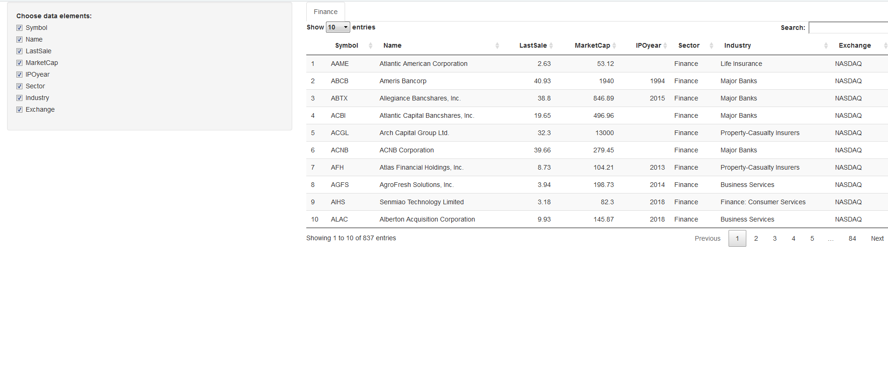

Project Presentation
========================================================
author: Alex Karsakov
date: Thu Feb 21 23:04:06 2019

Introduction
========================================================

The project has two parts: 

- create a Shiny application and deploy it on Rstudio's servers
- use Rstudio Presenter to prepare a reproducible pitch presentation about our application

In this project we create the interactive dashboard containing some essential data of different financial companies. User can choose data elements about companies, like abbreviation, market capitalization, industry, sector, sales, number of entries  etc. 


Code (Server part)
========================================================

The link to the full codebook on GitHub and RPubs web-page is on the final slide.  


```r
#Server part
function(input, output, session) {
  
  #Subset Finance sector
  nasdaq_names = stockSymbols(exchange = "NASDAQ")
  ...
  
  #Convert all values into millions
  idx = grep("B",df$MarketCap)
  ...
  
  output$mytable1 <- DT::renderDataTable({
    DT::datatable(Finance[, input$show_vars, drop = FALSE])
  })
}
```

```
function(input, output, session) {
  
  #Subset Finance sector
  nasdaq_names = stockSymbols(exchange = "NASDAQ")
  ...
  
  #Convert all values into millions
  idx = grep("B",df$MarketCap)
  ...
  
  output$mytable1 <- DT::renderDataTable({
    DT::datatable(Finance[, input$show_vars, drop = FALSE])
  })
}
```

Screenshot of interactive dashboard
========================================================



Links to Github 
========================================================

https://github.com/alexanderkarsakov/Course-9-Project/tree/master

 

